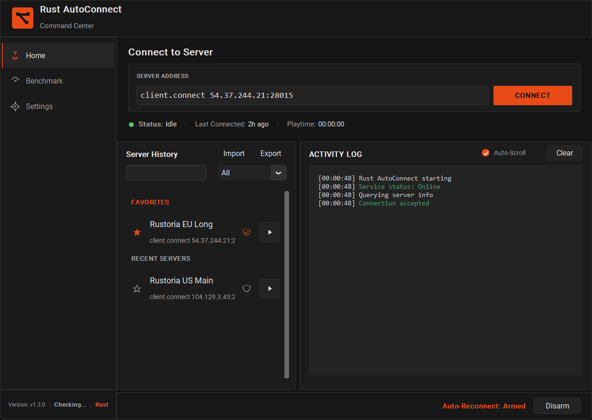

# AutoConnect for Rust

[](https://opensource.org/licenses/MIT)
[](https://www.python.org/downloads/)
[]()

AutoConnect is a robust, log-based server connection manager for the game Rust. Designed with strict adherence to Easy Anti-Cheat (EAC) guidelines, it provides automated server queuing, crash recovery, and wipe scheduling without injecting into the game's memory space.

## Features



- **Safe Log-Based Monitoring**: Operates entirely by parsing standard Rust output logs. Zero memory injection ensures complete safety from anti-cheat systems.
- **Smart Auto-Arming**: Automatically detects when you successfully connect to a server and "arms" the connection. If your game crashes or you are disconnected unexpectedly, AutoConnect will instantly restart Rust and place you back in the queue.
- **Wipe Schedule Intelligence**: Integrates with BattleMetrics and community leaderboards to predict and track server wipes in real-time.
- **Swarm Peer-to-Peer Network**: A decentralized queue-tracking mechanism using Supabase Realtime. When a peer successfully connects to a server, they instantly notify all other queued users, enabling rapid mass-reconnects during wipe day.
- **Performance Benchmarking**: Automated testing framework that measures game loading times (Time-to-Menu and Map Load) by playing standardized `.dem` files.
- **Telegram Integration**: Receive queue updates and wipe notifications directly to your phone via the integrated Telegram bot framework.

## Architecture

The application is built on a modern asynchronous Python stack (`asyncio`) to guarantee minimal memory footprint and zero interface stuttering, even during intense background polling.

- **GUI**: CustomTkinter
- **Networking**: `asyncio` UDP A2S Client for non-blocking server queries
- **Data Persistence**: JSON-based local history store
- **Realtime Infrastructure**: Supabase Edge Functions & WebSockets

## Installation & Setup

1. **Prerequisites**: Python 3.10 or higher.
2. **Clone the repository**:
   ```bash
   git clone https://github.com/abura2222v2/rust-autoconnect.git
   cd rust-autoconnect
   ```
3. **Install dependencies**:
   ```bash
   pip install -r requirements.txt
   ```
4. **Environment Variables**:
   Copy `.env.example` to `.env` (or set them in your system environment) and configure your Supabase Publishable Key and WebSockets URL for Swarm functionality. *Do not use Service Role keys.*
5. **Run**:
   ```bash
   python main.py
   ```

## Building the Executable

To compile AutoConnect into a standalone Windows executable (`.exe`):

```bash
pyinstaller --noconfirm --onedir --windowed --add-data "assets;assets" --icon "assets/icon.ico" "main.py"
```

## Contributing

Contributions are welcome. Please ensure that all modifications strictly adhere to the log-parsing philosophy. Any pull requests introducing memory manipulation or injection techniques will be rejected immediately to maintain EAC compliance.

## License

This project is licensed under the MIT License - see the LICENSE file for details.
